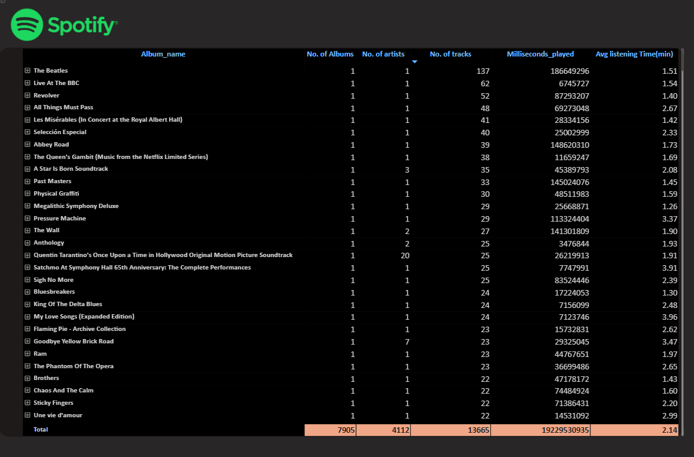

# 🎵 Spotify Music Insights Dashboard (Power BI)

---

## 📌 Project Overview
This **3-page interactive Power BI dashboard** analyzes Spotify listening trends, albums, artists, tracks, and user behavior.  
It transforms raw Spotify data into actionable insights for understanding engagement patterns.

**Dashboard Pages:**  
1. **Overview** – Summary of albums, artists, tracks, Top 5 performers, and YoY trends.  
2. **Listening Patterns** – Heatmaps for peak listening hours and scatter plots for track engagement.  
3. **Details** – Exportable grid with drill-through, drill-up, and hierarchical navigation.

---

## 🖼 Dashboard Screenshots

### 1️⃣ Overview Page

### 2️⃣ Listening Patterns

### 3️⃣ Details Page

---

## 💡 Key Insights Delivered
- ✅ Identified **peak listening hours & days** for Spotify users.  
- ✅ Highlighted **top albums, artists, and tracks** by frequency and engagement.  
- ✅ Compared **latest year vs previous year** to uncover growth trends.  
- ✅ Categorized tracks using **scatter plot quadrant analysis**.

---

## 🛠 Tech Stack & Tools
- **Power BI Desktop** – Dashboard creation & visualization  
- **Power Query** – Data cleaning & transformation  
- **DAX** – Calculated measures & KPIs  
- **Data Modeling** – Relationships, hierarchies, drill-through functionality  
- **Charts & Visuals** – Heatmaps, scatter plots, bar charts, tables  
- **Exportable Grids** – Detailed exploration

---

## 🔄 Project Workflow
1. Requirement Gathering & Business Understanding  
2. Data Walkthrough & Connection  
3. Data Cleaning / Quality Check  
4. Data Modeling & Processing  
5. DAX Calculations  
6. Dashboard Layout, Charts Development & Formatting  
7. Insights Generation  

---

## 📂 Folder Structure
